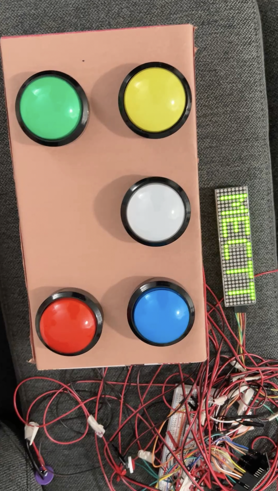
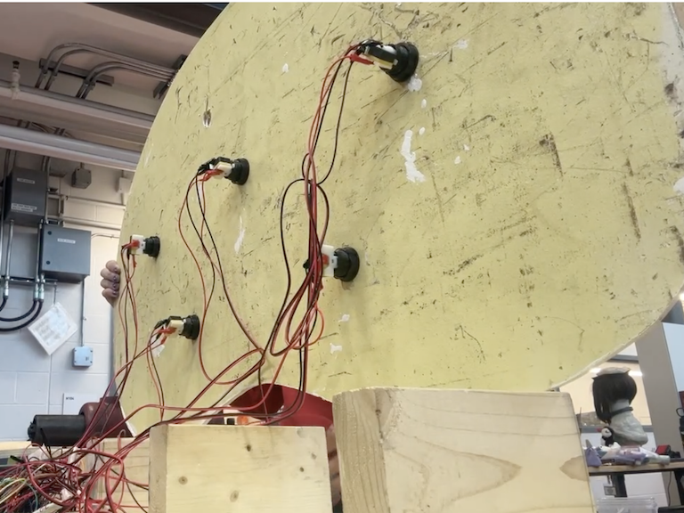
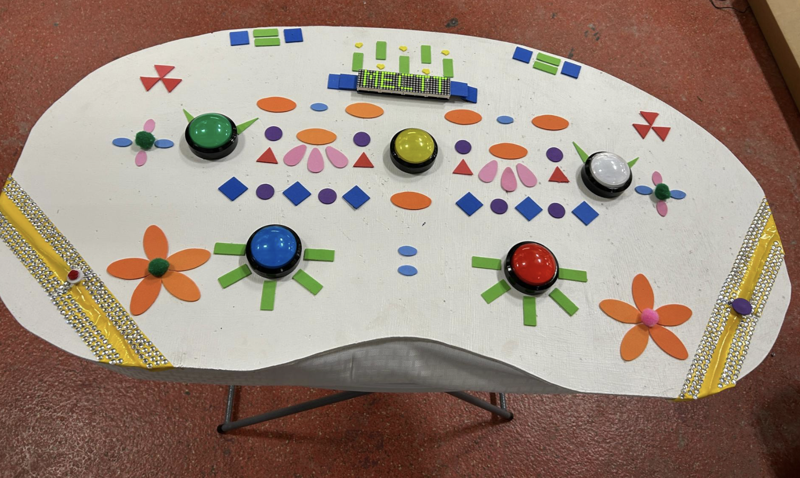
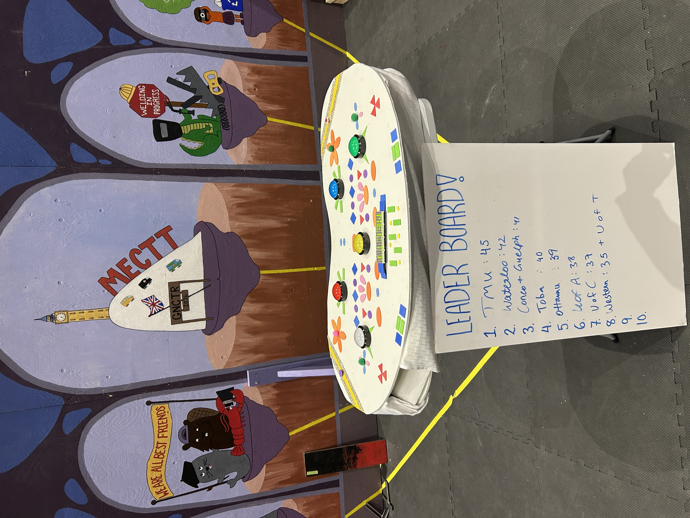

# Whack-A-Mole: Inside Out Edition

An emotion-themed arcade game with an interactive browser demo and ESP32 firmware for a physical prototype. The project explores fast reaction gameplay, embedded systems, and a web experience that recreates the feel of playing the arcade game.

## Play online

Play the live GitHub Pages demo: [Whack-A-Mole: Inside Out Edition](https://anushka768.github.io/Whack-A-Mole-Emotion-Game/whack-a-emotion-website/homepage.html).
### Gameplay videos

Watch the physical game demonstrations at two difficulty levels:

- [Watch medium-level gameplay on YouTube](https://www.youtube.com/watch?v=Ch7rrBap1OI)
- [Watch hard-level gameplay on YouTube](https://www.youtube.com/watch?v=i5hrfq9jv-M)
## From prototype to final product

### 1. Prototype

The early physical prototype brought five colored arcade buttons together on a simple rectangular panel, with exposed wiring and an LED matrix display. This setup provided a starting point for developing the physical game before integrating it into the final console.



*Early prototype: a compact button panel with the electronics accessible during development.*

### 2. Process: assembly and wiring

The buttons were then integrated into a larger, curved wooden playing surface. The underside view shows the button mounting and wiring during assembly, documenting how the physical controls were incorporated into the console.



*Assembly in progress: mounting the buttons and routing their wiring beneath the playing surface.*

### 3. Final product

The finished console combines the five colored buttons and LED matrix display with a decorated playing surface. The colorful geometric details and flowers give the physical game a playful visual identity.



*Completed console: physical controls and the display integrated into the decorated surface.*

The event photo shows the completed game presented with a leaderboard, bringing the build into a shared arcade setting.



*Final presentation: the game on display alongside player scores.*

## Project overview

The browser version plays a sequence of animated scenes while six colorful on-screen targets appear for the player to tap. It includes player setup, Easy and Hard difficulties, automatic scoring and results, rules, and a leaderboard.

- Easy displays one target at a time; Hard displays groups of two or three.
- A correct hit adds one point. An empty tap or an expired target removes one point; the score is clamped at zero.
- The round lasts about 30 seconds. The win threshold is 10 points on Easy and 20 on Hard.
- The leaderboard is stored in the current browser using `localStorage`. It is not a shared or cloud leaderboard.
- The demo is browser-only: it does not currently connect to an ESP32 or Firebase.

The web game is a simulation inspired by the physical arcade experience. Animated GIF scenes play behind the interactive targets; this is not a video stream.

## Play locally

No build step or package installation is needed. Run a local server:

```bash
cd whack-a-emotion-website
python3 -m http.server 8000
```

Open <http://localhost:8000/> to enter the game. A local server is recommended for reliable asset loading and browser storage.

## Technical overview

| Area | Technology |
| --- | --- |
| Web pages | HTML |
| Layout and visual styling | CSS |
| Page navigation, gameplay, and scoring | Vanilla JavaScript |
| Game visuals | Local GIF, PNG, and JPEG assets |
| Browser state and leaderboard | `localStorage` |
| Physical controller | ESP32 Arduino firmware |
| Matrix display | MAX7219 modules with `MD_Parola` and `MD_MAX72xx` |
| Target LED outputs | SN74HC595N shift register |

The website organizes its flow into separate pages for the home screen, player details, waiting screen, game, results, rules, and leaderboard. Shared state is saved in `localStorage`; the game script manages target timers, active targets, score changes, scene sequencing, and round completion.

### Object-oriented programming

The project uses OOP concepts primarily in the embedded implementation:

- The firmware creates library objects such as the `MD_Parola` matrix controller, `MD_MAX72XX` display interface, and `WebServer`.
- A `Mole` structure keeps each target's LED index, button pin, and active/hit state together.
- `GameState` and `Difficulty` enums model explicit game modes and difficulty settings.
- Functions for spawning targets, evaluating hits, resetting the game, and ending the round keep responsibilities separated.

The browser code uses functions and built-in collections rather than custom JavaScript classes; its shared state map and page-specific scripts separate navigation from gameplay.

### Iterative development

The numbered `.ino` sketches at the repository root record hardware iterations: direct GPIO control, clearer state and timing logic, matrix feedback, and shift-register-driven LEDs. The integrated sketch brings together the ESP32, physical targets and controls, display, buzzer, and a small HTTP interface.

The browser demo applies an iterative approach to the player experience: it lets the game run without the physical device, adds an interactive target row over the animated scenes, implements difficulty-specific rules, calculates outcomes automatically, and records scores locally.

## Physical hardware

The integrated firmware is [`Whack_a_emotion_hardware/Whack_a_emotion_hardware.ino`](Whack_a_emotion_hardware/Whack_a_emotion_hardware.ino). It specifies:

- ESP32 development board.
- SN74HC595N eight-bit shift register for target LED outputs.
- Five target LEDs and five momentary target buttons.
- Four daisy-chained MAX7219 8×8 LED matrix modules.
- Reset and difficulty buttons.
- Active buzzer for feedback.
- Prototype wiring, a suitable power supply, and current-limiting components for LEDs.

The sketch is not a complete wiring diagram or bill of materials. Verify ratings, connections, and the ESP32 board variant before powering the circuit.

| Function | ESP32 GPIO |
| --- | --- |
| Shift-register data / clock / latch | 27 / 26 / 25 |
| Matrix data / clock / chip select | 21 / 22 / 15 |
| Reset / difficulty buttons | 32 / 33 |
| Active buzzer | 17 |
| Five target buttons | 16, 23, 19, 13, 18 |

The target LEDs are driven by the shift register, not directly by ESP32 GPIO. Firmware dependencies are `MD_Parola` and `MD_MAX72xx`; `SPI`, `WiFi`, and `WebServer` come from the ESP32 Arduino core. The firmware creates an ESP32 Wi-Fi access point and serves `/state` and `/score` endpoints; the standalone browser game does not use them.
